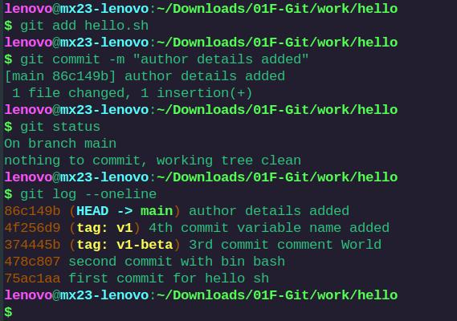

# git audit

## Git commits to commit

1.  Did the student navigate to the <code>work</code> directory and create a subdirectory named <code>hello</code> ?
    

2.  Did the student generate a file named <code>hello.sh</code> with the content **echo "Hello, World"** inside the <code>hello</code> directory?
3.  Did the student initialize a Git repository in the <code>hello</code> directory?
4.  Did the student use the <code>git status</code> command to check the status of the repository?
    
5.  Did the student modify the <code>hello.sh</code> file content with the provided **echo "Hello, $1"** ?
    
6.  Did the student stage the modified <code>hello.sh</code> file, commit the changes to the repository, and ensure that the working tree is clean afterward?
7.  Did the student further modify the <code>hello.sh</code> file to include comments, and then make two separate commits as instructed?
8.  Did the student make two separate commits, with the first commit for the comment in **line 1** and the second commit for the changes made to **lines 3 and 4** , as instructed?
    

## History

9.  Did the student display the Git history of the working directory with the <code>git log</code> command? See image above
10. Did the student successfully display a condensed view of the Git history, showing only commit hashes and messages using the "One-Line History" format?
    
    
11. Was the student able to customize the log output to display the last 2 entries?
    
12. Did the student successfully demonstrate viewing commits made within the last 5 minutes?
    
13. Did the student successfully customize the format of Git logs and display them according to this example \* e4e3645 2023-06-10 | Added a comment (HEAD -> main) [John Doe]?
    

## Check it out

14. Did the student successfully restore the first snapshot of the working tree and print the content of <code>hello.sh</code> ?
    
15. Did the student successfully restore the second recent snapshot and print the content of <code>hello.sh</code> ?
    
16. Did the student ensure that the working directory reflects the latest version of <code>hello.sh</code> from the main branch without using commit hashes?

    

## TAG me

17. Did the student successfully tag the current version of the repository as **v1** ?
    
18. Did the student successfully tag the version immediately prior to the current version as **v1-beta** , without relying on commit hashes?
    
19. Did the student navigate back and forth between the two tagged versions, **v1** and **v1-beta** ?
20. Did the student display a list of all tags present in the repository to verify successful tagging?
    

## Changed your mind?

21. Did the student successfully revert the modifications made to the latest version of the file, restoring it to its original state before staging using a **Git** command?
    
22. Did the student introduce unwanted changes to the file, stage them, and then successfully clean the staging area to discard the changes?
    
23. Did the student add unwanted changes again, stage the file, commit the changes, and then revert them back to their original state?
    
    
24. Did the student tag the latest commit with oops and remove commits made after the v1 version, ensuring that the HEAD points to v1?
    
25. Did the student display the logs with the deleted commits, particularly focusing on the commit tagged **oops** ?
    
26. Did the student ensure that unreferenced commits were deleted from the history, with no logs remaining for these deleted commits?
    
    
27. Did the student add author information to the file and commit the changes?
    
28. Did the student update the file to include the author email without making a new commit, but included the change in the last commit?
    

## Move it

29. Did the student successfully move the <code>hello.sh</code> program into a <code>lib/</code> directory using Git commands?
    
30. Did the student commit the move of <code>hello.sh</code> ? see above image
31. Did the student create and commit a <code>Makefile</code> in the root directory of the repository with the provided content?
    

## blobs, trees and commits

32. Ask the student to navigate to the <code>.git/</code> directory and explain to you the purpose of each subdirectory, including **objects/**, **config**, **refs** , and **HEAD** .
    
33. Was the student able to explain the purpose of each subdirectory, including **objects/** \*/, **config** , **refs** , and **HEAD** ?
    
34. Did the student successfully find the latest object hash within the <code>.git/objects/</code> directory using Git commands?
    
35. Was the student able to print the type and content of this object using Git commands?
    
36. Did the student use Git commands to dump the directory tree referenced by a specific commit? see image above
37. Were they able to dump the contents of the <code>lib/</code> directory and the <code>hello.sh</code> file using Git commands?
    

## Branching, Merging & Rebasing

38. Did the student successfully create and switch to a new branch named <code>greet</code> ?
    
39. Did the student create and commited a new file named <code>greeter.sh</code> in the <code>lib</code> directory with the provided code in it?
    
    
40. Did the student update the <code>lib/hello.sh</code> file with the provided content, stage, and commit the changes? see above image
41. Did the student update the <code>Makefile</code> with the comment, stage, and commit the changes?
    
    
42. Was the student able to compare and show the differences between the <code>main</code> and <code>greet</code> branches for the <code>Makefile</code >, <code>hello.sh</code> , and <code>greeter.sh</code> files?
    
    
    
    
43. Did the student generate a **README.md** file with the provided content and commit it?
    
44. Did the student draw a commit tree diagram illustrating the diverging changes between all branches to demonstrate the branch history?
    

## Conflicts, merging and rebasing

45. Did the student successfully merge the changes from the <code>main</code> branch into the <code>greet</code> branch?
    
46. Did the student make the specified changes to the <code>hello.sh</code> file in the <code>main</code> branch and commit them?
    
47. Did the student attempt to merge the <code>main</code> branch into the <code>greet</code> branch creating a conflict during the merge?
    
48. Did the student successfully resolve the conflict, accepting changes from the main branch?
    
49. Did the student commit the conflict resolution changes?
    
50. Did the student return to the point before the initial merge between <code>main</code> and <code>greet</code> ? see image above
51. Did the student rebase the <code>greet</code> branch on top of the latest changes in the <code>main</code> branch?
    
52. Did the student successfully merge the changes from the <code>greet</code> branch into the <code>main</code> branch?
    
53. Ask the student to explain the difference between merging and rebasing and if he understand Fast-Forwarding.

### Fast-Forwarding

- Happens when main has no new commits since greet branched off.
- Instead of creating a merge commit, Git just moves main forward to greet's latest commit.
- No extra commit is created.

```bash
Before Merge:
main:  A---B
greet:     \---C---D

After Fast-Forward Merge:
main:  A---B---C---D  (main just moves forward)
```

### Merge

- Happens when main and greet both have new commits.
- Git creates a new merge commit that combines both histories.

```bash
Before Merge:
main:  A---B---E---F
greet:      \---C---D

After Merge:
main:  A---B---E---F---M (Merge Commit)
                \---C---D
```

### Rebase

- Linear rewrites history
- Changes commit hashes
- Clean history, collaboration

```bash
Before Rebase:
main:  A---B---E---F
greet:      \---C---D

After Rebase:
greet:  A---B---E---F---C'---D'
```

54. Did the student demonstrate an understanding of fast-forwarding?
55. was the student able to explain the difference between merging and rebasing?

## Local & Remote Repo

56. Did the student complete the cloning process of the <clone>hello</clone> repository to <clone>cloned_hello</code> ?
    
57. Did the student fetch and merge changes from the remote repository into the <code>main</code> branch?
    
58. Did the student list both remote and local branches, make changes to the original repository, and synchronize the cloned repository with remote changes?
    
59. Did the student successfully clone the <code>hello</code> repository into the <code>work/</code> directory as <code>cloned_hello</code> , without using the copy command? see quest56 image above
60. Did the student show the logs for the <code>cloned_hello</code> repository? see quest58 image above
61. Did the student display the name of the remote repository **(origin)** and provide more information about it?
    
62. Did the student list all remote and local branches in the <code>cloned_hello</code> repository?
    
63. Did the student make changes to the original repository, update the **README.md** file with the provided content, and commit the changes?
    
64. Inside the cloned repository <code>cloned_hello</code>, did the student fetch the changes from the remote repository and display the logs, ensuring commits from the <code>hello</code> repository are included?
    
65. Did the student merge the changes from the remote <code>main</code> branch into the local <code>main branch?
    
66. Did the student add a local branch named <code>greet</code> tracking the remote <code>origin/greet</code> branch?
    
67. Did the student add a <code>remote</code> reference to their Git repository?
    
68. Did the student push the <code>main</code> and <code>greet</code> branches to the <code>remote</code> repository?
    

### Ask the following question to the student:

**What is the single git command equivalent to what you did before to bring changes from remote to local <code>main</code> branch?**

69. Did the student provide an accurate response?
    <code>git pull --rebase origin main</code>

## Bare Repository

- to create a bare repo <code>git init --bare repo-name.git</code>
- <code>ls repo-name.git</code> the output is

```bash
HEAD
config
description
hooks/
info/
objects/
refs/
```

- Why a bare repo is needed?
  - for collaboration and storage centralization
  - acts as a **remote repo** that many devs can push-to and pull-from
  - GitHub, GitLab, and self hosted Git servers use bare repos
  - prevents accidental changes
  - as there is no **working directory** users cannot modify files directly
  - ensures the central repo remains _clean_
  - useful for deployment and automation
  - CD/CI some workflows use a bare repo with **Git hooks** to deploy code automatically when updates are pushed.

70. Did the student successfully create a bare repository named <code>hello.git</code> from the existing <code>hello</code> repository?
    

71. Did the student add the bare <code>hello.git</code> repository as a remote to the original repository <code>hello<code> ?
    

72. Did the student change the **README.md** file in the original repository, commit the change, and push it to the shared repository?
    
73. Did the student switch to the cloned repository <code>cloned_hello</code> and successfully pull down the changes just pushed to the shared repository?
    
    
    
